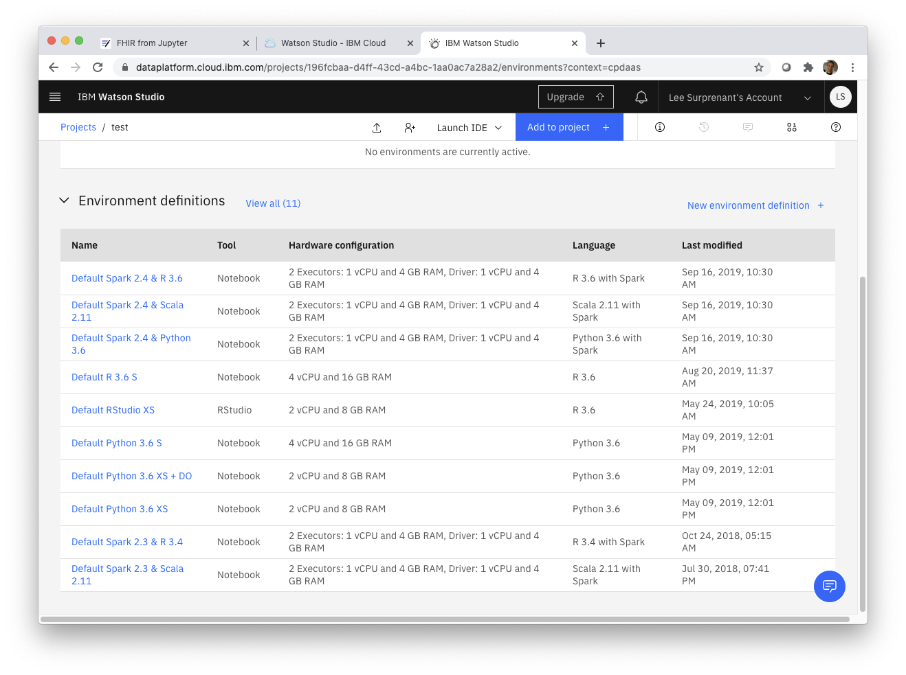

# Let's Build: FHIR from Jupyter

In this lab, we import the following Jupyter notebooks into IBM Watson Studio within IBM Cloud Pak for Data:
1. The FHIR API
2. FHIR in Spark
3. Predictive Modeling

Notebooks 1 and 3 should work from almost any Jupyter notebook environment, but notebook 2 uses Apache Spark to process bulk FHIR resources into a flattened dataframe and therefor must run in a Jupyter environment with access to spark.

Notebook 1 is configured to use an instance of the IBM FHIR Server running on IBM Cloud which has been loaded with sample data generated from the Synthea(TM) Patient Generator.

Notebook 2 requires access to a Cloud Object Store with FHIR R4 resources from [SyntheticMass](https://synthea.mitre.org/downloads) and hosted on [Google Cloud](gs://gcp-fhir-demo-dataset-synthea).

Notebook 3 builds a predictive model from Parquet files that are built in notebook 2 from features extracted from the FHIR resources.

## Getting started

### Download the notebooks

Clone or download the notebooks from this repo to your local system.

### Register / log in to IBM Cloud

1. Navigate to https://dataplatform.cloud.ibm.com/registration/stepone
2. Choose `Dallas` to be nearest to the data for this lab
    

If you already have an IBMid, enter it on the right.
If not, enter a valid email address on the left, agree to the terms, click *Next*, and check your email to complete the registration process.

Once registered and logged in, continue to the Watson Studio dashboard.

### Create a project

1. From the Watson Studio dashboard, click `New project +`
    
2. Select *Create an empty project*
    
3. Given the project a name (e.g. FHIR from Jupyter) and click `Add` to define a storage service
    
4. Select a plan (the free `Lite` plan should be fine) and click Create

### Create an environment

From the Project dashboard, click `Add to project +` and

Select **Default Spark 2.4 & Python 3.7**

### Create a notebook

Create a notebook, select the **From file** tab, and import one of the notebook files downloaded in the [Download the notebooks section](#Download-the-notebooks).
